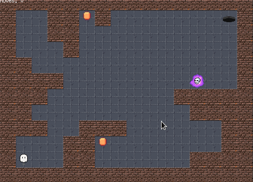

<p align="center">
  
</p>

# 🎮 so_long

A project developed as part of the 42 School curriculum. It is a simple 2D game rendered with **MiniLibX**, where the player collects coins and escapes the map. The bonus version includes animations, a move counter on screen, and enemies.

---

## 🚀 Project Overview

**so_long** is a small 2D game where the player moves around a map, collects all collectibles (`C`), and exits through the portal (`E`). The map is read from a `.ber` file and displayed using custom sprites. The project follows Norminette and includes a bonus version with enhanced features.

<p align="center">
  
</p>

---

## 🛠️ Key Features

### 🔸 Mandatory Version

- Validates `.ber` map files
- Checks for rectangular shape and closed walls
- Requires one player, one exit, at least one coin
- Movement using `W`, `A`, `S`, `D` **and** arrow keys
- Step counter printed in the terminal

### 🔹 Bonus Version

- Animated sprites (player, coin, enemy)
- Enemy (`X`) that moves automatically
- Step counter displayed in the game window
- Game ends when player touches the enemy

---

## 🎮 Controls

- `W` or `↑` – Move up  
- `A` or `←` – Move left  
- `S` or `↓` – Move down  
- `D` or `→` – Move right  
- `ESC` – Quit the game

---

## 🧪 How to Run

### 🔧 Compile and run the mandatory version:

- ```bash
    make
- ```bash
  ./so_long maps/map1.ber
### 🔧 Compile and run the bonus version:

- ```bash
    make bonus
- ```bash
  ./so_long_bonus maps/map1.ber
